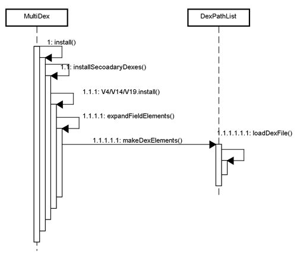
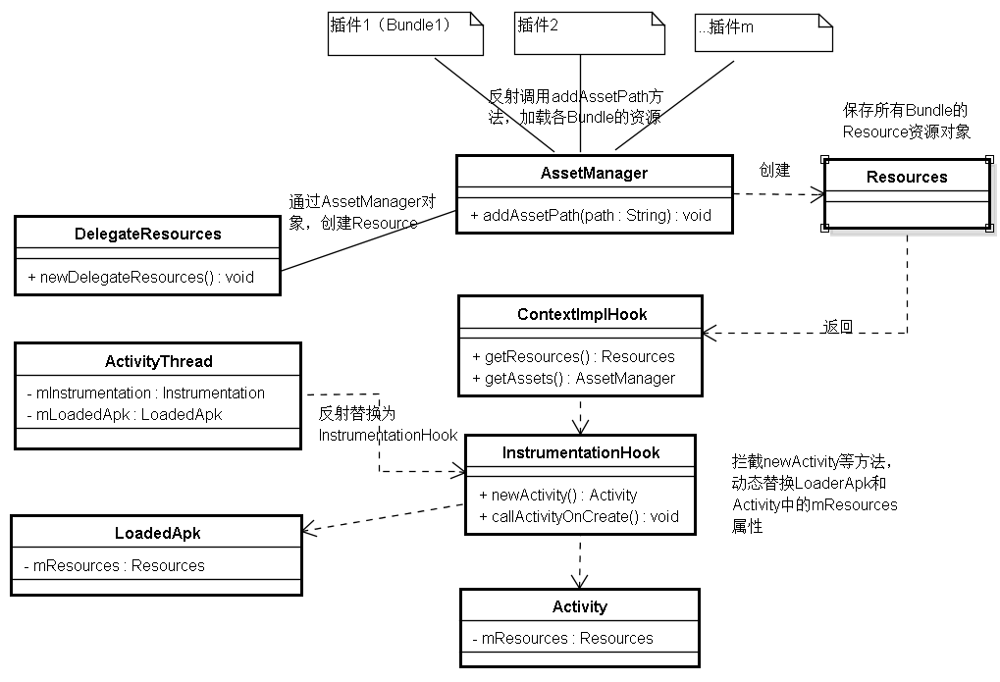
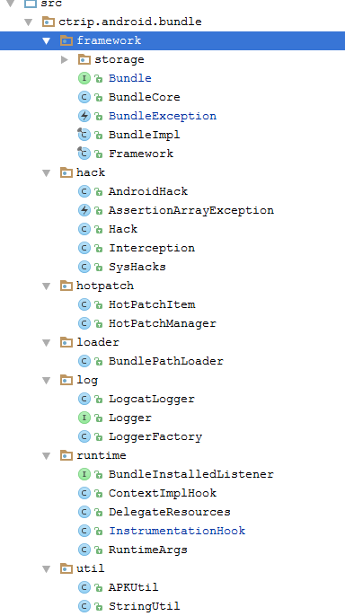

#携程DynamicAPK插件化框架源码分析

##插件核心思想

###1.aapt的改造
分别对不同的插件项目分配不同的packageId，然后对各个插件的资源进行编译，生成R文件，然后与宿主项目的R文件进行id的合并。<br>
要求：由于最终会将所有的资源文件id进行合并，因此，所有的资源名称均不能相同。

###2.运行ClassLoader加载各Bundle
和MultiDex的思路是一样的，所有的插件都被加载到同一个ClassLoader当中，因此，不同插件中的Class必须保持包名和类名的唯一。否则，加载过的类不会再次被加载。<br>
优缺点：各个Bundle之间完全可以相互调用，但是这也造成了各个Bundle之间ClassLoader的非隔离性。并且随着数组的加长，每次findClass的时间会变长，对性能照成一定长度的影响。<br>
让我们在熟悉一下这张图：


在DynamicAPK框架中，每个Bundle被加载到ClassLoader的调用栈如下：
Bundle的Application：BundleBaseApplication
->BundleBaseApplication(onCreate)
   ->BundleCore(run)
     ->BundleImpl(optDexFile)
      ->BundleArchiveRevision(optDexFile)
        ->BundlePathLoader(installBundleDexs)
         ->...

###3.热修复
由于所有的插件都被加载到同一个ClassLoader当中，因为，热修复的方案都是从dexElements数组的顺序入手，修改expandFieldArray方法的实现，将修复的类放到dexElements的前方。核心代码如下（详见BundlePathLoader）：
```java

 private static void expandFieldArray(Object instance, String fieldName,
                                         Object[] extraElements,boolean isHotFix) throws NoSuchFieldException, IllegalArgumentException,
            IllegalAccessException {
        synchronized (BundlePathLoader.class) {
            Field jlrField = findField(instance, fieldName);
            Object[] original = (Object[]) jlrField.get(instance);
            Object[] combined = (Object[]) Array.newInstance(
                    original.getClass().getComponentType(), original.length + extraElements.length);
            if(isHotFix) {
                System.arraycopy(extraElements, 0, combined, 0, extraElements.length);
                System.arraycopy(original, 0, combined, extraElements.length, original.length);
            }else {
                System.arraycopy(original, 0, combined, 0, original.length);
                System.arraycopy(extraElements, 0, combined, original.length, extraElements.length);
            }
            jlrField.set(instance, combined);
        }
    }

```

调用的关键代码如下(HotPatchItem.class)：<br>

```java
   public void optDexFile() throws Exception{
        List<File> files = new ArrayList<File>();
        files.add(this.hotFixFile);
        BundlePathLoader.installBundleDexs(RuntimeArgs.androidApplication.getClassLoader(), storageDir, files, false);
    }

    public void optHotFixDexFile() throws Exception{
        List<File> files = new ArrayList<File>();
        files.add(this.hotFixFile);
        BundlePathLoader.installBundleDexs(RuntimeArgs.androidApplication.getClassLoader(), storageDir, files, true);
    }
```

###4.运行时资源的加载
所有插件的资源都加载到DelegateResources中，关键代码如下：<br>
DelegateResources.class<br>

```java
...
public static void newDelegateResources(Application application, Resources resources) throws Exception {
        List<Bundle> bundles = Framework.getBundles();
        if (bundles != null && !bundles.isEmpty()) {
            Resources delegateResources;
            List<String> arrayList = new ArrayList();
            arrayList.add(application.getApplicationInfo().sourceDir);
            for (Bundle bundle : bundles) {
                arrayList.add(((BundleImpl) bundle).getArchive().getArchiveFile().getAbsolutePath());
            }
            AssetManager assetManager = AssetManager.class.newInstance();
            for (String str : arrayList) {
                SysHacks.AssetManager_addAssetPath.invoke(assetManager, str);
            }
            //处理小米UI资源
            if (resources == null || !resources.getClass().getName().equals("android.content.res.MiuiResources")) {
                delegateResources = new DelegateResources(assetManager, resources);
            } else {
                Constructor declaredConstructor = Class.forName("android.content.res.MiuiResources").getDeclaredConstructor(new Class[]{AssetManager.class, DisplayMetrics.class, Configuration.class});
                declaredConstructor.setAccessible(true);
                delegateResources = (Resources) declaredConstructor.newInstance(new Object[]{assetManager, resources.getDisplayMetrics(), resources.getConfiguration()});
            }
            RuntimeArgs.delegateResources = delegateResources;
            AndroidHack.injectResources(application, delegateResources);
            StringBuffer stringBuffer = new StringBuffer();
            stringBuffer.append("newDelegateResources [");
            for (int i = 0; i < arrayList.size(); i++) {
                if (i > 0) {
                    stringBuffer.append(",");
                }
                stringBuffer.append(arrayList.get(i));
            }
            stringBuffer.append("]");
            log.log(stringBuffer.toString(), Logger.LogLevel.DBUG);
        }
    }

...

```
<br>
上述代码就是将所有Bundle中的资源，通过调用AssetManager的addAssetPath方法，加载到assetManager对象中，然后再用assetManager对象，创建delegateResources对象，并保存在RuntimeArgs.delegateResources当中，然后调用AndroidHack.injectResources方法，对Application和LoadedApk中的mResources成员变量进行注入，代码如下：<br>
```java
 public static void injectResources(Application application, Resources resources) throws Exception {
        Object activityThread = getActivityThread();
        if (activityThread == null) {
            throw new Exception("Failed to get ActivityThread.sCurrentActivityThread");
        }
        Object loadedApk = getLoadedApk(activityThread, application.getPackageName());
        if (loadedApk == null) {
            throw new Exception("Failed to get ActivityThread.mLoadedApk");
        }
        SysHacks.LoadedApk_mResources.set(loadedApk, resources);
        SysHacks.ContextImpl_mResources.set(application.getBaseContext(), resources);
        SysHacks.ContextImpl_mTheme.set(application.getBaseContext(), null);
    }
```
其中，上述获取LoadedApk的代码，也是通过反射，获取运行时ActivityThread类的LoadedApk对象.

###5.运行时HooK,动态替换Resource对象

####ContextImplHook,动态替换getResources
为了控制startActivity的时候，能够及时替换Activity的Resource和AssetsManager对象，使用ContextImplHook类对Comtext进行替换，然后动态的返回上一步加载的RuntimeArgs.delegateResources委托资源对象。ContextImplHook的核心代码如下：
```java

    @Override
    public Resources getResources() {
        log.log("getResources is invoke", Logger.LogLevel.INFO);
        return RuntimeArgs.delegateResources;
    }

    @Override
    public AssetManager getAssets() {
        log.log("getAssets is invoke", Logger.LogLevel.INFO);
        return RuntimeArgs.delegateResources.getAssets();
    }

```
####如何在Activity跳转过程中，动态的替换呢
通过反射替换ActivityThread的mInstrumentation对象，替换成InstrumentationHook.class,然后就可以在执行startActivity时，拦截其newActivity和callActivityOnCreate方法，在newActivity方法中，动态的替换newActivity的mResources对象。在callActivityOnCreate方法中将ContextImplHook注入到新创建的Activity中。核心代码如下：<br>
```java

    @Override
    public Activity newActivity(Class<?> cls, Context context, IBinder iBinder, Application application, Intent intent, ActivityInfo activityInfo, CharSequence charSequence, Activity activity, String str, Object obj) throws InstantiationException, IllegalAccessException {
        Activity newActivity = this.mBase.newActivity(cls, context, iBinder, application, intent, activityInfo, charSequence, activity, str, obj);
        if (RuntimeArgs.androidApplication.getPackageName().equals(activityInfo.packageName) && SysHacks.ContextThemeWrapper_mResources != null) {
            SysHacks.ContextThemeWrapper_mResources.set(newActivity, RuntimeArgs.delegateResources);
        }
        return newActivity;
    }

    @Override
    public Activity newActivity(ClassLoader classLoader, String str, Intent intent) throws InstantiationException, IllegalAccessException, ClassNotFoundException {
        Activity newActivity;
        try {
            newActivity = this.mBase.newActivity(classLoader, str, intent);
            if (SysHacks.ContextThemeWrapper_mResources != null) {
                SysHacks.ContextThemeWrapper_mResources.set(newActivity, RuntimeArgs.delegateResources);
            }
        } catch (ClassNotFoundException e) {
            String property = Framework.getProperty("ctrip.android.bundle.welcome", "ctrip.android.view.home.CtripSplashActivity");
            if (StringUtil.isEmpty(property)) {
                throw e;
            } else {
                List runningTasks = ((ActivityManager) this.context.getSystemService(Context.ACTIVITY_SERVICE)).getRunningTasks(1);
                if (runningTasks != null && runningTasks.size() > 0 && ((ActivityManager.RunningTaskInfo) runningTasks.get(0)).numActivities > 1) {
                    if (intent.getComponent() == null) {
                        intent.setClassName(this.context, str);
                    }
                }
                log.log("Could not find activity class: " + str, Logger.LogLevel.WARN);
                log.log("Redirect to welcome activity: " + property, Logger.LogLevel.WARN);
                newActivity = this.mBase.newActivity(classLoader, property, intent);
            }
        }
        return newActivity;
    }

    @Override
    public void callActivityOnCreate(Activity activity, Bundle bundle) {
        if (RuntimeArgs.androidApplication.getPackageName().equals(activity.getPackageName())) {
            ContextImplHook contextImplHook = new ContextImplHook(activity.getBaseContext());
            if (!(SysHacks.ContextThemeWrapper_mBase == null || SysHacks.ContextThemeWrapper_mBase.getField() == null)) {
                SysHacks.ContextThemeWrapper_mBase.set(activity, contextImplHook);
            }
            SysHacks.ContextWrapper_mBase.set(activity, contextImplHook);
        }
        this.mBase.callActivityOnCreate(activity, bundle);
    }

```

总结如下图,Resource的加载和动态替换：


###6.插件Activity在宿主AndroidManifest中的预注册
每个插件的Activity，必须在宿主的AndroidManifest.xml中进行注册。

##DynamicAPK源码导读：
源代码的目录结构图

<br>

- framework<br>
  管理各个Bundle以及各个Bundle的封装、版本控制等。<br>
- hack<br>
  通过反射的形式，hack类，方法，成员变量等<br>
- hotpatch<br>
  热修复相关的封装<br>
- loader<br>
  对MultiDex的修改，各Bundle加载到ClassLoader，热修复。<br>
- log<br>
  日志管理<br>
- runtime<br>
  运行时，对Resources进行动态替换<br>
- util<br>
  工具类<br>


##参考
[1.AssetManager源码]()<br>
[2.LoadedApk源码](https://github.com/android/platform_frameworks_base/blob/master/core/java/android/app/LoadedApk.java)<br>
[3.ActivityThread源码](https://github.com/android/platform_frameworks_base/blob/master/core/java/android/app/ActivityThread.java)<br>
[4.DynamicAPK源码](https://github.com/CtripMobile/DynamicAPK)<br>

