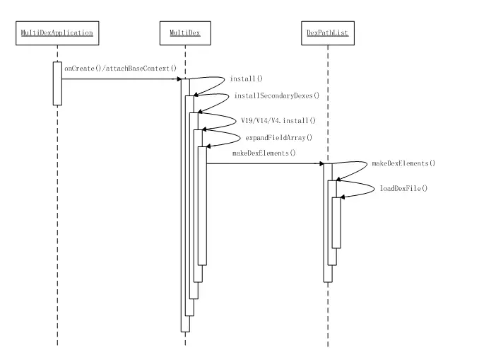

#Android插件化（一）：使用改进的MultiDex动态加载assets中的apk#

##简介
为了解决65535方法数超标的问题，Google推荐使用MultiDex来加载classes2.dex,classes3.dex等等，其基本思想就是在运行时动态修改ClassLoader，以达到动态加载类的目的。为了更好的理解MultiDex的工作原理，可以先看一下ClassLoader的工作原理[1].然后参见PathClassLoader的源码，当然，它继承自BaseDexClassLoader，主要源码都在BaseDexClassLoader中。MultiDex加载离线apk的过程如下：


我们可以在Application的onCreate方法或者Activity的attachBaseContext方法中开发加载。
##动态加载assets中的apk
根据MultiDex的源码，我们可以修改其install方法，然后从assets资源中解压出所需要加载的apk文件，然后调用installSecondaryDexes方法，将其加载到当前Application的ClassLoader当中，这样，在运行的时候，就可以通过当前的ClassLoader查找到离线apk中的类了。
###[AssetsMultiDexLoader.class]

```java
package net.mobctrl.hostapk;

import java.io.File;
import java.io.FilenameFilter;
import java.io.IOException;
import java.lang.reflect.Array;
import java.lang.reflect.Field;
import java.lang.reflect.InvocationTargetException;
import java.lang.reflect.Method;
import java.util.ArrayList;
import java.util.Arrays;
import java.util.HashSet;
import java.util.List;
import java.util.ListIterator;
import java.util.Set;
import java.util.zip.ZipFile;

import android.content.Context;
import android.content.pm.ApplicationInfo;
import android.content.pm.PackageManager;
import android.content.pm.PackageManager.NameNotFoundException;
import android.os.Build;
import android.util.Log;
import dalvik.system.DexFile;

/**
 * @Author Zheng Haibo
 * @Mail mochuan.zhb@alibaba-inc.com
 * @Company Alibaba Group
 * @PersonalWebsite http://www.mobctrl.net
 * @version $Id: AssetsDex.java, v 0.1 2015年12月10日 下午5:36:23 mochuan.zhb Exp $
 * @Description ClassLoader
 */
public class AssetsMultiDexLoader {

	private static final String TAG = "AssetsApkLoader";

	private static boolean installed = false;

	private static final int MAX_SUPPORTED_SDK_VERSION = 20;

	private static final int MIN_SDK_VERSION = 4;

	private static final Set<String> installedApk = new HashSet<String>();

	private AssetsMultiDexLoader() {

	}

	/**
	 * 安装Assets中的apk文件
	 * 
	 * @param context
	 */
	public static void install(Context context) {
		Log.i(TAG, "install...");
		if (installed) {
			return;
		}
		try {
			clearOldDexDir(context);
		} catch (Throwable t) {
			Log.w(TAG,
					"Something went wrong when trying to clear old MultiDex extraction, "
							+ "continuing without cleaning.", t);
		}
		AssetsManager.copyAllAssetsApk(context);
		Log.i(TAG, "install");
		if (Build.VERSION.SDK_INT < MIN_SDK_VERSION) {
			throw new RuntimeException("Multi dex installation failed. SDK "
					+ Build.VERSION.SDK_INT
					+ " is unsupported. Min SDK version is " + MIN_SDK_VERSION
					+ ".");
		}
		try {
			ApplicationInfo applicationInfo = getApplicationInfo(context);
			if (applicationInfo == null) {
				// Looks like running on a test Context, so just return without
				// patching.
				return;
			}
			synchronized (installedApk) {
				String apkPath = applicationInfo.sourceDir;
				if (installedApk.contains(apkPath)) {
					return;
				}
				installedApk.add(apkPath);
				if (Build.VERSION.SDK_INT > MAX_SUPPORTED_SDK_VERSION) {
					Log.w(TAG,
							"MultiDex is not guaranteed to work in SDK version "
									+ Build.VERSION.SDK_INT
									+ ": SDK version higher than "
									+ MAX_SUPPORTED_SDK_VERSION
									+ " should be backed by "
									+ "runtime with built-in multidex capabilty but it's not the "
									+ "case here: java.vm.version=\""
									+ System.getProperty("java.vm.version")
									+ "\"");
				}
				/*
				 * The patched class loader is expected to be a descendant of
				 * dalvik.system.BaseDexClassLoader. We modify its
				 * dalvik.system.DexPathList pathList field to append additional
				 * DEX file entries.
				 */
				ClassLoader loader;
				try {
					loader = context.getClassLoader();
				} catch (RuntimeException e) {
					/*
					 * Ignore those exceptions so that we don't break tests
					 * relying on Context like a android.test.mock.MockContext
					 * or a android.content.ContextWrapper with a null base
					 * Context.
					 */
					Log.w(TAG,
							"Failure while trying to obtain Context class loader. "
									+ "Must be running in test mode. Skip patching.",
							e);
					return;
				}
				if (loader == null) {
					// Note, the context class loader is null when running
					// Robolectric tests.
					Log.e(TAG,
							"Context class loader is null. Must be running in test mode. "
									+ "Skip patching.");
					return;
				}
				// 获取dex文件列表
				File dexDir = context.getDir(AssetsManager.APK_DIR, Context.MODE_PRIVATE);
				File[] szFiles = dexDir.listFiles(new FilenameFilter() {

					@Override
					public boolean accept(File dir, String filename) {
						return filename.endsWith(AssetsManager.FILE_FILTER);
					}
				});
				List<File> files = new ArrayList<File>();
				for (File f : szFiles) {
					Log.i(TAG, "load file:" + f.getName());
					files.add(f);
				}
				Log.i(TAG, "loader before:" + context.getClassLoader());
				installSecondaryDexes(loader, dexDir, files);
				Log.i(TAG, "loader end:" + context.getClassLoader());
			}
		} catch (Exception e) {
			Log.e(TAG, "Multidex installation failure", e);
			throw new RuntimeException("Multi dex installation failed ("
					+ e.getMessage() + ").");
		}
		installed = true;
		Log.i(TAG, "install done");
	}

	private static ApplicationInfo getApplicationInfo(Context context)
			throws NameNotFoundException {
		PackageManager pm;
		String packageName;
		try {
			pm = context.getPackageManager();
			packageName = context.getPackageName();
		} catch (RuntimeException e) {
			/*
			 * Ignore those exceptions so that we don't break tests relying on
			 * Context like a android.test.mock.MockContext or a
			 * android.content.ContextWrapper with a null base Context.
			 */
			Log.w(TAG,
					"Failure while trying to obtain ApplicationInfo from Context. "
							+ "Must be running in test mode. Skip patching.", e);
			return null;
		}
		if (pm == null || packageName == null) {
			// This is most likely a mock context, so just return without
			// patching.
			return null;
		}
		ApplicationInfo applicationInfo = pm.getApplicationInfo(packageName,
				PackageManager.GET_META_DATA);
		return applicationInfo;
	}

	private static void installSecondaryDexes(ClassLoader loader, File dexDir,
			List<File> files) throws IllegalArgumentException,
			IllegalAccessException, NoSuchFieldException,
			InvocationTargetException, NoSuchMethodException, IOException {
		if (!files.isEmpty()) {
			if (Build.VERSION.SDK_INT >= 19) {
				V19.install(loader, files, dexDir);
			} else if (Build.VERSION.SDK_INT >= 14) {
				V14.install(loader, files, dexDir);
			} else {
				V4.install(loader, files);
			}
		}
	}

	/**
	 * Locates a given field anywhere in the class inheritance hierarchy.
	 *
	 * @param instance
	 *            an object to search the field into.
	 * @param name
	 *            field name
	 * @return a field object
	 * @throws NoSuchFieldException
	 *             if the field cannot be located
	 */
	private static Field findField(Object instance, String name)
			throws NoSuchFieldException {
		for (Class<?> clazz = instance.getClass(); clazz != null; clazz = clazz
				.getSuperclass()) {
			try {
				Field field = clazz.getDeclaredField(name);

				if (!field.isAccessible()) {
					field.setAccessible(true);
				}

				return field;
			} catch (NoSuchFieldException e) {
				// ignore and search next
			}
		}

		throw new NoSuchFieldException("Field " + name + " not found in "
				+ instance.getClass());
	}

	/**
	 * Locates a given method anywhere in the class inheritance hierarchy.
	 *
	 * @param instance
	 *            an object to search the method into.
	 * @param name
	 *            method name
	 * @param parameterTypes
	 *            method parameter types
	 * @return a method object
	 * @throws NoSuchMethodException
	 *             if the method cannot be located
	 */
	private static Method findMethod(Object instance, String name,
			Class<?>... parameterTypes) throws NoSuchMethodException {
		for (Class<?> clazz = instance.getClass(); clazz != null; clazz = clazz
				.getSuperclass()) {
			try {
				Method method = clazz.getDeclaredMethod(name, parameterTypes);

				if (!method.isAccessible()) {
					method.setAccessible(true);
				}

				return method;
			} catch (NoSuchMethodException e) {
				// ignore and search next
			}
		}

		throw new NoSuchMethodException("Method " + name + " with parameters "
				+ Arrays.asList(parameterTypes) + " not found in "
				+ instance.getClass());
	}

	/**
	 * Replace the value of a field containing a non null array, by a new array
	 * containing the elements of the original array plus the elements of
	 * extraElements.
	 * 
	 * @param instance
	 *            the instance whose field is to be modified.
	 * @param fieldName
	 *            the field to modify.
	 * @param extraElements
	 *            elements to append at the end of the array.
	 */
	private static void expandFieldArray(Object instance, String fieldName,
			Object[] extraElements) throws NoSuchFieldException,
			IllegalArgumentException, IllegalAccessException {
		Field jlrField = findField(instance, fieldName);
		Object[] original = (Object[]) jlrField.get(instance);
		Object[] combined = (Object[]) Array.newInstance(original.getClass()
				.getComponentType(), original.length + extraElements.length);
		System.arraycopy(original, 0, combined, 0, original.length);
		System.arraycopy(extraElements, 0, combined, original.length,
				extraElements.length);
		jlrField.set(instance, combined);
	}

	private static void clearOldDexDir(Context context) throws Exception {
		File dexDir = context.getDir(AssetsManager.APK_DIR, Context.MODE_PRIVATE);
		if (dexDir.isDirectory()) {
			Log.i(TAG, "Clearing old secondary dex dir (" + dexDir.getPath()
					+ ").");
			File[] files = dexDir.listFiles();
			if (files == null) {
				Log.w(TAG, "Failed to list secondary dex dir content ("
						+ dexDir.getPath() + ").");
				return;
			}
			for (File oldFile : files) {
				Log.i(TAG, "Trying to delete old file " + oldFile.getPath()
						+ " of size " + oldFile.length());
				if (!oldFile.delete()) {
					Log.w(TAG, "Failed to delete old file " + oldFile.getPath());
				} else {
					Log.i(TAG, "Deleted old file " + oldFile.getPath());
				}
			}
			if (!dexDir.delete()) {
				Log.w(TAG,
						"Failed to delete secondary dex dir "
								+ dexDir.getPath());
			} else {
				Log.i(TAG, "Deleted old secondary dex dir " + dexDir.getPath());
			}
		}
	}

	/**
	 * Installer for platform versions 19.
	 */
	private static final class V19 {

		private static void install(ClassLoader loader,
				List<File> additionalClassPathEntries, File optimizedDirectory)
				throws IllegalArgumentException, IllegalAccessException,
				NoSuchFieldException, InvocationTargetException,
				NoSuchMethodException {
			/*
			 * The patched class loader is expected to be a descendant of
			 * dalvik.system.BaseDexClassLoader. We modify its
			 * dalvik.system.DexPathList pathList field to append additional DEX
			 * file entries.
			 */
			Field pathListField = findField(loader, "pathList");
			Object dexPathList = pathListField.get(loader);
			ArrayList<IOException> suppressedExceptions = new ArrayList<IOException>();
			expandFieldArray(
					dexPathList,
					"dexElements",
					makeDexElements(dexPathList, new ArrayList<File>(
							additionalClassPathEntries), optimizedDirectory,
							suppressedExceptions));
			if (suppressedExceptions.size() > 0) {
				for (IOException e : suppressedExceptions) {
					Log.w(TAG, "Exception in makeDexElement", e);
				}
				Field suppressedExceptionsField = findField(loader,
						"dexElementsSuppressedExceptions");
				IOException[] dexElementsSuppressedExceptions = (IOException[]) suppressedExceptionsField
						.get(loader);

				if (dexElementsSuppressedExceptions == null) {
					dexElementsSuppressedExceptions = suppressedExceptions
							.toArray(new IOException[suppressedExceptions
									.size()]);
				} else {
					IOException[] combined = new IOException[suppressedExceptions
							.size() + dexElementsSuppressedExceptions.length];
					suppressedExceptions.toArray(combined);
					System.arraycopy(dexElementsSuppressedExceptions, 0,
							combined, suppressedExceptions.size(),
							dexElementsSuppressedExceptions.length);
					dexElementsSuppressedExceptions = combined;
				}

				suppressedExceptionsField.set(loader,
						dexElementsSuppressedExceptions);
			}
		}

		/**
		 * A wrapper around
		 * {@code private static final dalvik.system.DexPathList#makeDexElements}
		 * .
		 */
		private static Object[] makeDexElements(Object dexPathList,
				ArrayList<File> files, File optimizedDirectory,
				ArrayList<IOException> suppressedExceptions)
				throws IllegalAccessException, InvocationTargetException,
				NoSuchMethodException {
			Method makeDexElements = findMethod(dexPathList, "makeDexElements",
					ArrayList.class, File.class, ArrayList.class);

			return (Object[]) makeDexElements.invoke(dexPathList, files,
					optimizedDirectory, suppressedExceptions);
		}
	}

	/**
	 * Installer for platform versions 14, 15, 16, 17 and 18.
	 */
	private static final class V14 {

		private static void install(ClassLoader loader,
				List<File> additionalClassPathEntries, File optimizedDirectory)
				throws IllegalArgumentException, IllegalAccessException,
				NoSuchFieldException, InvocationTargetException,
				NoSuchMethodException {
			/*
			 * The patched class loader is expected to be a descendant of
			 * dalvik.system.BaseDexClassLoader. We modify its
			 * dalvik.system.DexPathList pathList field to append additional DEX
			 * file entries.
			 */
			Field pathListField = findField(loader, "pathList");
			Object dexPathList = pathListField.get(loader);
			expandFieldArray(
					dexPathList,
					"dexElements",
					makeDexElements(dexPathList, new ArrayList<File>(
							additionalClassPathEntries), optimizedDirectory));
		}

		/**
		 * A wrapper around
		 * {@code private static final dalvik.system.DexPathList#makeDexElements}
		 * .
		 */
		private static Object[] makeDexElements(Object dexPathList,
				ArrayList<File> files, File optimizedDirectory)
				throws IllegalAccessException, InvocationTargetException,
				NoSuchMethodException {
			Method makeDexElements = findMethod(dexPathList, "makeDexElements",
					ArrayList.class, File.class);

			return (Object[]) makeDexElements.invoke(dexPathList, files,
					optimizedDirectory);
		}
	}

	/**
	 * Installer for platform versions 4 to 13.
	 */
	private static final class V4 {
		private static void install(ClassLoader loader,
				List<File> additionalClassPathEntries)
				throws IllegalArgumentException, IllegalAccessException,
				NoSuchFieldException, IOException {
			/*
			 * The patched class loader is expected to be a descendant of
			 * dalvik.system.DexClassLoader. We modify its fields mPaths,
			 * mFiles, mZips and mDexs to append additional DEX file entries.
			 */
			int extraSize = additionalClassPathEntries.size();

			Field pathField = findField(loader, "path");

			StringBuilder path = new StringBuilder(
					(String) pathField.get(loader));
			String[] extraPaths = new String[extraSize];
			File[] extraFiles = new File[extraSize];
			ZipFile[] extraZips = new ZipFile[extraSize];
			DexFile[] extraDexs = new DexFile[extraSize];
			for (ListIterator<File> iterator = additionalClassPathEntries
					.listIterator(); iterator.hasNext();) {
				File additionalEntry = iterator.next();
				String entryPath = additionalEntry.getAbsolutePath();
				path.append(':').append(entryPath);
				int index = iterator.previousIndex();
				extraPaths[index] = entryPath;
				extraFiles[index] = additionalEntry;
				extraZips[index] = new ZipFile(additionalEntry);
				extraDexs[index] = DexFile.loadDex(entryPath, entryPath
						+ ".dex", 0);
			}

			pathField.set(loader, path.toString());
			expandFieldArray(loader, "mPaths", extraPaths);
			expandFieldArray(loader, "mFiles", extraFiles);
			expandFieldArray(loader, "mZips", extraZips);
			expandFieldArray(loader, "mDexs", extraDexs);
		}
	}

}

```

###[AssetsManager.java]

```java
package net.mobctrl.hostapk;

import java.io.File;
import java.io.FileOutputStream;
import java.io.InputStream;
import java.io.OutputStream;

import android.content.Context;
import android.content.res.AssetManager;
import android.util.Log;

/**
 * @Author Zheng Haibo
 * @Mail mochuan.zhb@alibaba-inc.com
 * @Company Alibaba Group
 * @PersonalWebsite http://www.mobctrl.net
 * @version $Id: AssetsManager.java, v 0.1 2015年12月11日 下午4:41:10 mochuan.zhb Exp $
 * @Description
 */
public class AssetsManager {
	
	public static final String TAG = "AssetsApkLoader";
	
	//从assets复制出去的apk的目标目录
	public static final String APK_DIR = "third_apk";
	
	//文件结尾过滤
	public static final String FILE_FILTER = ".apk";
	
	
	/**
	 * 将资源文件中的apk文件拷贝到私有目录中
	 * 
	 * @param context
	 */
	public static void copyAllAssetsApk(Context context) {

		AssetManager assetManager = context.getAssets();
		long startTime = System.currentTimeMillis();
		try {
			File dex = context.getDir(APK_DIR, Context.MODE_PRIVATE);
			dex.mkdir();
			String []fileNames = assetManager.list("");
			for(String fileName:fileNames){
				if(!fileName.endsWith(FILE_FILTER)){
					return;
				}
				InputStream in = null;
				OutputStream out = null;
				in = assetManager.open(fileName);
				File f = new File(dex, fileName);
				if (f.exists() && f.length() == in.available()) {
					Log.i(TAG, fileName+"no change");
					return;
				}
				Log.i(TAG, fileName+" chaneged");
				out = new FileOutputStream(f);
				byte[] buffer = new byte[2048];
				int read;
				while ((read = in.read(buffer)) != -1) {
					out.write(buffer, 0, read);
				}
				in.close();
				in = null;
				out.flush();
				out.close();
				out = null;
				Log.i(TAG, fileName+" copy over");
			}
			Log.i(TAG,"###copyAssets time = "+(System.currentTimeMillis() - startTime));
		} catch (Exception e) {
			e.printStackTrace();
		}

	}
}

```
以上就是从assets中加载apk的核心代码。

##DEMO运行
打开BundleApk项目，编译成apk。然后将BundleApk.apk文件拷贝到HostApk项目的assets目录，在HostApk的MainActivity方法的onCreate当中，调用AssetsMultiDexLoader.install(getApplicationContext());加载BundleApk.apk。然后我们就可以通过如下两种方式调用BundleApk中的类：

- Class.forName<br>
由于我们的HostApk没有BundleApk类的引用，所以我们需要用反射的方式调用。
```java
private void loadClass(){
		try{
			Class<?> clazz = Class.forName("net.mobctrl.normal.apk.FileUtils");
			
			Constructor<?> constructor = clazz.getConstructor();
			Object bundleUtils = constructor.newInstance();

			Method printSumMethod = clazz.getMethod("print", Context.class,String.class);
			printSumMethod.setAccessible(true);
			printSumMethod.invoke(bundleUtils,
					getApplicationContext(), "Hello");
		}catch(Exception e){
			e.printStackTrace();
		}
		
	}
```
- loadClass<br>
我们也可以直接获取当前的ClassLoader对象，然后调用其loadClass方法
```java
@TargetApi(Build.VERSION_CODES.ICE_CREAM_SANDWICH)
	private void loadApk() {
		try {
			Class<?> clazz = getClassLoader()
					.loadClass("net.mobctrl.normal.apk.Utils");
			Constructor<?> constructor = clazz.getConstructor();
			Object bundleUtils = constructor.newInstance();

			Method printSumMethod = clazz.getMethod("printSum", Context.class,
					int.class, int.class, String.class);
			printSumMethod.setAccessible(true);
			Integer sum = (Integer)printSumMethod.invoke(bundleUtils,
					getApplicationContext(), 10, 20, "计算结果");
			System.out.println("debug:sum = " + sum);
		} catch (ClassNotFoundException e) {
			e.printStackTrace();
		} catch (SecurityException e) {
			e.printStackTrace();
		} catch (NoSuchMethodException e) {
			e.printStackTrace();
		} catch (IllegalArgumentException e) {
			e.printStackTrace();
		} catch (InstantiationException e) {
			e.printStackTrace();
		} catch (IllegalAccessException e) {
			e.printStackTrace();
		} catch (InvocationTargetException e) {
			e.printStackTrace();
		}
	}
```


#参考文章
[1].[ClassLoader的工作原理](http://segmentfault.com/a/1190000004062880)
[2].[PathClassLoader源码](https://android.googlesource.com/platform/libcore-snapshot/+/ics-mr1/dalvik/src/main/java/dalvik/system)
[3].[MultiDex源码](https://android.googlesource.com/platform/frameworks/multidex/+/d79604bd38c101b54e41745f85ddc2e04d978af2/library/src/android/support/multidex)