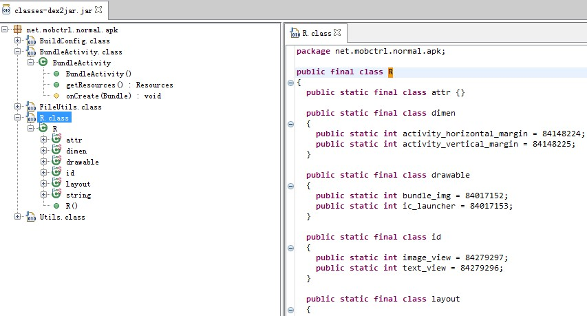

#Android插件化基础（4），动态启动插件中的Activity

<br>
##Author：莫川
##简介
如何动态启动插件中的Activity呢？我们首先分析，启动插件中的Activity需要做那些准备？

- 1.插件中Activity类的加载<br>
也就是ClassLoader的问题。由第一节课中的MultiDex可以知道，我们可以动态的加载apk，然后将插件中的class加载到当前的ClassLoader当中。这样，插件中的class和宿主中的class同属一个ClassLoader,它们之间的相互调用问题也就解决了。
- 2.插件中Activity在AndroidManifest.xml中的注册问题<br>
由于插件apk有自己的AndroidManifest文件，为了能够在运行时，动态启动插件中的Activity，需要在打包时，将插件apk的Activity注册移动到宿主apk的AndroidManifest文件中。
- 3.插件中Activity的资源加载问题<br>
处理插件中的资源加载问题，是插件化最难的问题之一!我们需要考虑很多问题：<br>
1.插件Activity运行时如何实时获取Resources对象，并且能够根据插件包名对应下的R文件的id，查找到Resources中的资源。
2.插件apk中的资源文件与其他插件及宿主之间的资源名称冲突如何解决？
3.宿主及各插件的资源如何统一并且方便的管理？

##问题的解决：

###1.类的加载
我们使用之前我们改造的AssetsMultiDexLoader，来加载assets目录下的apk。由于之前的博客已经说明了问题，再次不在赘述。

###2.插件中的Activity在宿主AndroidManifest中注册
这件事情需要在打包时处理，也就是说，我们需要改造我们的打包工具，在打包时，将各个插件的AndroidManifest文件合并到宿主AndroidManifest文件中。

###3.插件资源的加载问题

我们需要在编译过程和运行过程分别做处理：

####3.1 编译过程
我们首先回顾一下Android打包的过程：<br>
1.生成R.java文件<br>
比如：<br>
```xml
aapt package -f -m -J ./gen -S res -M AndroidManifest.xml -I D:\android_sdk_for_studio\platforms\android-22\android.jar
```
2.清空bin目录<br>
清空上次生成的文件
3.编译java文件和jar包<br>
```xml
javac -encoding GBK -target 1.5 -bootclasspath D:\android_sdk_for_studio\platforms\android-22\android.jar -d bin src\net\mobctrl\normal\apk\*.java gen\net\mobctrl\normal\apk\R.java -classpath libs\*.jar
```
4.使用dx工具打包成classes.dex<br>
```xml
dx --dex --output=C:\Users\mochuan.zhb\newworkspace\BundleApk5\bin\classes.dex C:\Users\mochuan.zhb\newworkspace\BundleApk5\bin\
```
5.编译成资源文件<br>
```xml
aapt package -f -M AndroidManifest.xml -S res -I D:\android_sdk_for_studio\platforms\android-22\android.jar -F bin\resources.ap_ --non-constant-id
```
6.使用sdklib.jar工具生成未签名的apk<br>
```
java -cp D:\android_sdk_for_studio\tools\lib\sdklib.jar com.android.sdklib.build.ApkBuilderMain bin\MyCommond.apk -v -u -z bin\resources.ap_ -f bin\classes.dex -rf C:\Users\mochuan.zhb\newworkspace\BundleApk5\src
```
7.使用jarsigner对apk进行签名<br>
jarsigner -verbose -keystore C:\test.keystore -storepass 123456 -keypass 123456 -signedjar C:\projectdemo-signed.apk C:\test.apk test
<br>

###3.2编译过程的修改
为了解决插件与插件之间以及宿主之间的资源冲突问题，我们需要对插件进行编号，修改R文件的生成过程。我们知道，R文件中的ID是一个int类型，总共32位。那么这32位分别代表什么含义呢？<br>
1.前8位代表插件的packageId，其中两个特殊的Id：Host是0x7f，android系统自带的是以0x01开头.<br>
2.紧跟着的8位是区分资源类型的，比如layout，id,string,dimen等<br>
3.后面16位是资源的编号<br>

为了解决资源的命名冲突，一般由以下2中方法：<br>
####1.约定<br>
团队在开发时，对资源的命名进行约定，比如各业务线按照一定的规则命名，大家准守规则，避免重复。
然后在打包时，我们对各个插件的资源进行合并，统一生成R文件，所有插件和宿主的R文件内容都是完全一样的，资源都保存在宿主项目的资源中。<br>
说明：Google使用的Android打包过程，就是这样的。比如主project依赖lib_project1,lib_project2等，在编译主project的时候，它就将各个lib项目的资源都复制到主project中，然后使用aapt进行统一生成R文件，生成多个不同包名的R文件，但是R文件的内容是完全一样的。<br>
####2.修改aapt<br>
为了从机制上避免资源名称重复的问题，我们可以通过修改aapt的源码，让其可以根据不同的packageId生成不同的id。也就是说，R文件中的id由以下32位组成：<br>
[packageId(8)][resourceType(8)][resourcesSeq(16)]<br>
我们为每一个插件分配一个packageId,范围是(1,127).
修改aapt的源码之后，我们需要改动打包过程中的第一步和第五步，在生成R文件和编译资源的时候，使用我们改造后的aapt。这样，最终生成的apk，其R文件就是按照我们分配的方式。<br>
我们可以通过反编译，查看test.apk中的R文件，如下图所示，我们设定的packageId是5：

【test.apk的反编译图】
反编译之后的id需要转化为16进制显示。<br>
*注*：<br>
反编译步骤：<br>
1.解压apk文件<br>
2.使用d2j-dex2jar工具，将dex转化为jar<br>
3.使用Java-Decompiler反编译jar<br>

###3.3运行过程中资源的加载

####1.将插件apk加载到当前的AssetsManager中
核心代码：

```java
    /**
	 * 修改AssetManager
	 * 
	 * @param assetManager
	 * @param apkPaths
	 * @return
	 */
	private static AssetManager modifyAssetManager(AssetManager assetManager,
			List<String> apkPaths) {
		if (apkPaths == null || apkPaths.size() == 0) {
			return null;
		}
		try {
			for (String apkPath : apkPaths) {
				try {
					AssetManager.class.getDeclaredMethod("addAssetPath",
							String.class).invoke(assetManager, apkPath);
				} catch (Throwable th) {
					System.out.println("debug:createAssetManager :"
							+ th.getMessage());
					th.printStackTrace();
				}
			}
			return assetManager;
		} catch (Throwable th) {
			System.out.println("debug:createAssetManager :" + th.getMessage());
			th.printStackTrace();
		}
		return null;
	}

	/**
	 * 获取整个App的资源管理器中的资源
	 * 
	 * @param context
	 * @param apkPath
	 * @return
	 */
	public static Resources getAppResource(Context context) {
		System.out.println("debug:getAppResource ...");
		AssetsManager.copyAllAssetsApk(context);
		// 获取dex文件列表
		File dexDir = context.getDir(AssetsManager.APK_DIR,
				Context.MODE_PRIVATE);
		File[] szFiles = dexDir.listFiles(new FilenameFilter() {

			@Override
			public boolean accept(File dir, String filename) {
				return filename.endsWith(AssetsManager.FILE_FILTER);
			}
		});
		if (szFiles == null || szFiles.length == 0) {
			return context.getResources();
		}
		System.out.println("debug:getAppResource szFiles = "+szFiles.length);
		List<String> apkPaths = new ArrayList<String>();
		for (File f : szFiles) {
			Log.i(TAG, "load file:" + f.getName());
			apkPaths.add(f.getAbsolutePath());
			System.out.println("debug:apkPath = " + f.getAbsolutePath());
		}
		AssetManager assetManager = modifyAssetManager(context.getAssets(),
				apkPaths);
		AppResource resources = new AppResource(
				assetManager, context.getResources().getDisplayMetrics(),
				context.getResources().getConfiguration());
		return resources;
	}

```

####2.Application中Resources的加载<br>
核心代码<br>
```java

public class HostApplication extends Application {

	private Resources mAppResources = null;
	private Resources mOldResources = null;

	@Override
	public void onCreate() {
		super.onCreate();
		mOldResources = super.getResources();
		AssetsMultiDexLoader.install(this);// 加载assets中的apk
		installResource();
	}

	@Override
	public Resources getResources() {
		if(mAppResources == null){
			return mOldResources;
		}
		return this.mAppResources;
	}

	private void installResource() {
		if (mAppResources == null) {
			mAppResources = BundlerResourceLoader.getAppResource(this);// 加载assets中的资源对象
		}
	}

	@Override
	public AssetManager getAssets() {
		if (this.mAppResources == null) {
			return super.getAssets();
		}
		return this.mAppResources.getAssets();
	}

}

```

####3.插件Activity替换Resource对象<br>
以BundleActivity为例：<br>
```java
public class BundleActivity extends BaseActivity {

	@Override
	protected void onCreate(Bundle savedInstanceState) {
		super.onCreate(savedInstanceState);
		setContentView(R.layout.bundle_layout);
		findViewById(R.id.text_view).setOnClickListener(new View.OnClickListener() {
			
			@Override
			public void onClick(View view) {
				Toast.makeText(getApplicationContext(), "Hello", Toast.LENGTH_LONG).show();
			}
		});
	}
	
	@Override
	public Resources getResources() {
		return getApplication().getResources();
	}
	
}
```
最关键的是，重写getResources()方法，使用Application的Resource替换当前的Resource方法。

#参考
[1.关于Android如何动态加载res](http://nobodycare.me/2014/11/07/about-loading-res-from-apk-directly/)<br>
[2.Android应用程序资源的编译和打包过程分析](http://blog.csdn.net/luoshengyang/article/details/8744683)<br>
[3.Android应用程序资源管理器（Asset Manager）的创建过程分析](http://blog.csdn.net/luoshengyang/article/details/8791064)<br>
[4.Android 自动编译、打包生成apk文件 1 - 命令行方式](http://blog.csdn.net/androiddevelop/article/details/10948639)<br>
[5.使用ANT打包Android应用](http://blog.csdn.net/liuhe688/article/details/6679879)<br>
[6.如何修改android aapt源码实现自定义package ID ](http://blog.chinaunix.net/uid-28764633-id-5395048.html)<br>


